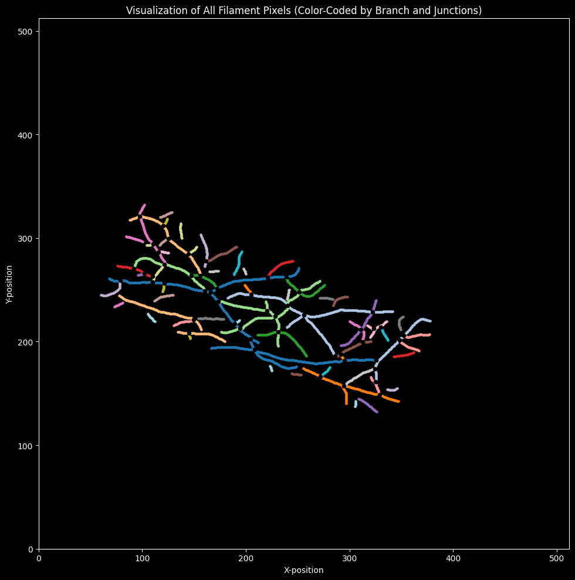

# Feature Extraction for SOAX Output Files

This code was made to automate metric estimation for filament image segemntation after being processed in SOAX. 
This pipeline allows for quick statistical analysis and visualization of filament segmentation images. This specific
project compares two strains of *Arabidopsis thaliana* epidermis cells. The statistics obtained from the pipeline allow
for quick comparison in possible actin filament mechanistic differences. The morphological descriptors
that can be calculated using this pipeline are:

1. Filament count: Gives amount of individual filaments in segmented image.
2. Filament length distributions: Length distributions for both type of strains from all images.
3. Filament intensity distributions: Pixel intensity distributions for a corresponding filament for both type of strains from all images.
4. Branching: Amount of junctions between individual filaments.
5. Convolutedness: Measure of the curvature of the cell.

# Usage

The script contains two Classes, `Filaments` and `Data`. Each SOAX output becomes a `Filament` object and obtains metrics such as the length of each 
filament in the image, how many filaments are in an image and amount of junctions. For the script to work propoerly, SOAX .txt type file need to be 
in the same folder. The Class `Data` has one parameter for the folder path. Initializing a `Data` instance, processes all images in the folder and 
saves all instances of `Filament` objects in two lists, one for wildtype strains and the other for mutant. Methods for both classes are explained below:

The Class `Filament` has 6 methods:

1. `Filament.get_filament_lengths()`: Returns a dataframe with filament lengths in microns and convolutedness.
2. `Flament.get_intensity()`: Returns a dataframe of pixel intensities from each filament, by substracting the background intensity from the forground intensity.
3. `Filament.plot_filaments()`: Plots a filaments by color code and the junctions catpured by SOAX.

The Class `Data` has 6 methods:

1. `Data.get_length_distributions(type)`: Returns a dataframe of length ditributions. The paramter type can be either 'wildtype' or 'mutant'.
2. `Data.plot_length_histogram()`: Plots a side by side histogram of the length distributions for both strains.
3. `Data.get_length_distributions(type)`: Returns a dataframe of intensity ditributions. The paramter type can be either 'wildtype' or 'mutant'.
4. `Data.plot_length_histogram()`: Plots a side by side histogram of the intensity distributions for both strains.
5. `Data.get_curvature_distributions(type)`: Returns a dataframe of convolutedness ditributions. The paramter type can be either 'wildtype' or 'mutant'.
6. `Data.plot_curvature_histogram()`: Plots a side by side histogram of the curvature distributions for both strains.

 

